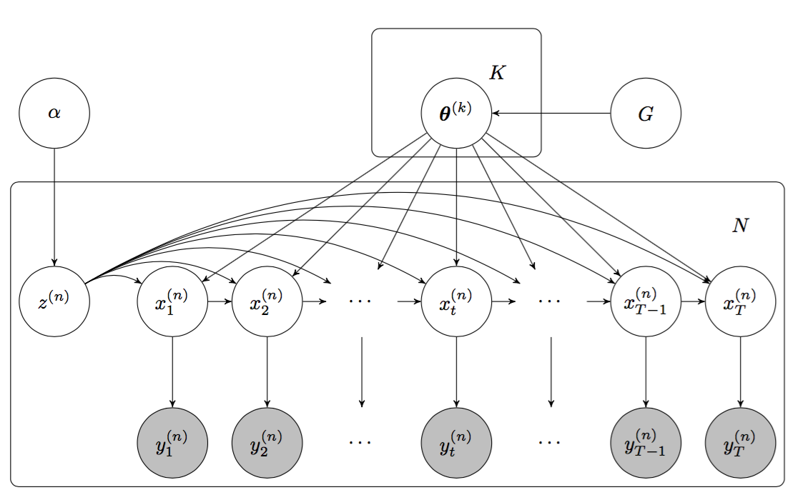

# Clustering Time Series with Nonlinear Dynamics: A Bayesian Non-Parametric and  Particle-Based Approach
### Alexander Lin, Yingzhuo Zhang, Jeremy Heng, Stephen A. Allsop, Kay M. Tye, Pierre E. Jacob, Demba Ba

The full AISTATS paper with mathematical details for this project can be found [here](http://proceedings.mlr.press/v89/lin19b.html).  This page gives a brief conceptual summary of the main methods and results.

## Problem and Motivation

Time series data are ubiquitous in everyday life.  From daily stock returns to hourly seismic activity to second-by-second recordings of a patient's heart rate, it is important to develop methodologies that can process and analyze data characterized by significant changes over time.

Time series clustering is a task involving the unsupervised categorization of various objects that each exhibits some dynamically changing component(s) recorded as time series data.  Based on the evolution of their respective time series, the objects are grouped into separate *clusters* in a way such that objects within the same cluster exhibit similar temporal dynamics that are sufficiently different from those of objects in other clusters.  

In computational neuroscience, a common type of recorded data is the *neuronal firing sequence* (also known as a *spike train*), which is a stream of binary 0-1 values over time that indicate when a neuron fired.  More specifically, at every time point, we record a '1' if the neuron fired and a '0' otherwise.  Fundamental questions in neuroscience are built on how to efficiently analyze collections of these firing sequences from various neurons in the brain.

We can think of a firing sequence from a single neuron as a time series.  Specifically, this is a time series that exhibits *nonlinear* dynamics, because each observed point in time may depend on previously observed points, but this relationship is nonlinear.  Clustering firing sequences from different neurons effectively clusters the neurons themselves.  In a data set comprising hundreds to thousands of neuronal time series, such a clustering can provide insights into how neural computation is implemented at the level of groups of neurons.  For instance, if a cluster of neurons all respond the same way to a stimulus, then it may be reasonable to hypothesize that these neurons comprise a network of interactions in the brain.  Thus, the ability to cluster times series is a useful tool in neuroscience research, because it can potentially reveal previously unknown relationships between groups of neurons, which can fuel the development of biological hypotheses about the brain.

## Methods 
We adopt a model-based approach to clustering time series that combines the *mixture model*, a popular generative model for clustered data, with the *state-space model*, a popular generative model for time series data.  The resultant model is named the **Dirichlet Process nonlinear State-Space Model** (DPnSSM).  The Dirichlet process aspect of the model refers to the fact that it assumes the number of clusters is a random variable that must be learned from the data.  The complete graphical model of the DPnSSM is given below.  The mathematical details can be found in the paper.

To recover a clustering of a set of observed time series, we must conduct posterior inference on this model to find distributions for the cluster assignments and the cluster parameters.  We adopt a Markov chain Monte Carlo approach that combines Gibbs sampling with recent advances in Monte Carlo, such as controlled sequential Monte Carlo and particle marginal Metropolis-Hastings.

## Results

We evaluate our algorithm on both simulated neuroscience data and real neuroscience data.  For the simulation, we generate five neurons each of the following five types:
1. excited, sustained
2. inhibited, sustained
3. non-responsive
4. excited, unsustained
5. inhibited, unsustained

Thus, there are a total of 25 simulated neurons.  Each neuron has an observed firing sequence based on its type.  Here is a heatmap of the mean co-occurrence matrix produced by the algorithm.  Each cell represents the posterior probability of two neurons belonging to the same cluster.  From this visualization, there are five clear clusters recovered by the algorithm.  These clusters correspond exactly to the ground-truth neuron types that were simulated.  Thus, we show that the algorithm performs as expected for this toy example.

We also qualitatively evaluate the algorithm on real data.  The paper has additional details.

## Future Work

We hope to find ways to speed up the inference algorithm, using parallelization techniques for example.  We are also interested in applying the algorithm to other domains, such as sports and sleep.  Furthermore, it would be interesting to see if the model and algorithm can be used for tasks other than clustering, such as time series imputation and time series forecasting.